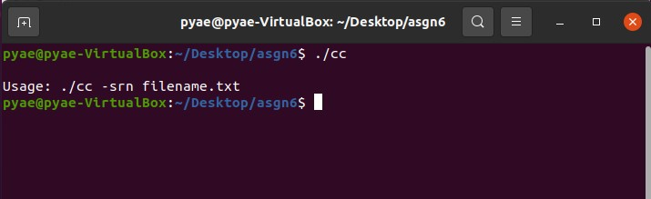
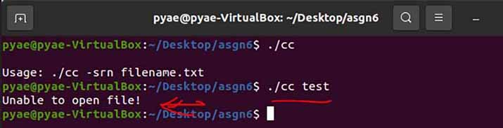
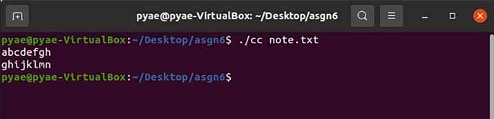
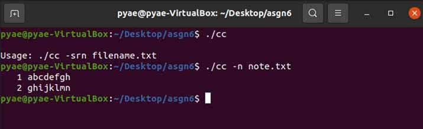
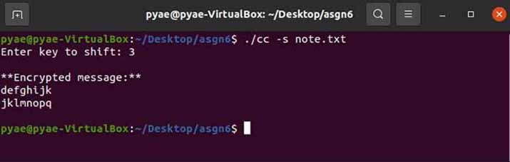
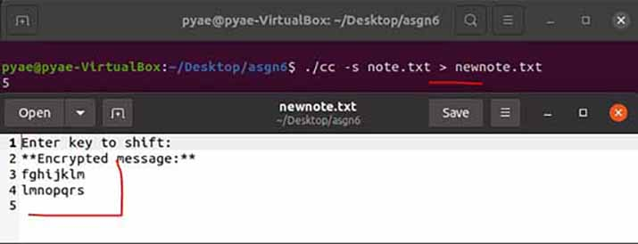
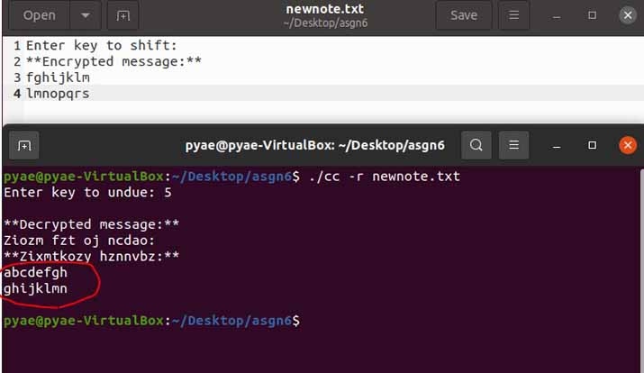

# CCIPHER (Caesar Cipher)

Linux Encryption/Decryption application using command line arguments in C

Using system calls to create a Caesar cipher application in C.

## How it works

Take command line arguments for the number of letters to shift and for the name of the file to open, read, and close.

`Synopsis`

    cipher [OPTION] … [FILE]...

`Description`

    Caesar cipher the contents of FILE, then concatenate to standard output.

`OPTIONS:`

    -s NUM
      NUM represents the number of letters to shift

    -r
      -r should reverse or ‘undue’.
      EX: -r 5: This will undue a message shifted 5.

    -n
      number all output lines

## `SCREENSHOTS`

